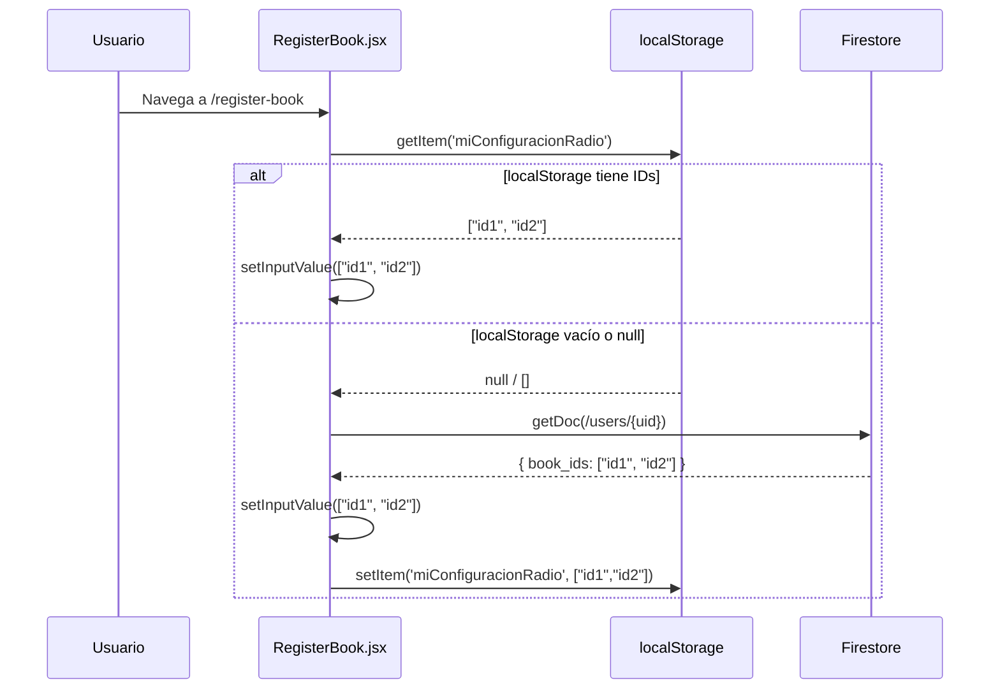
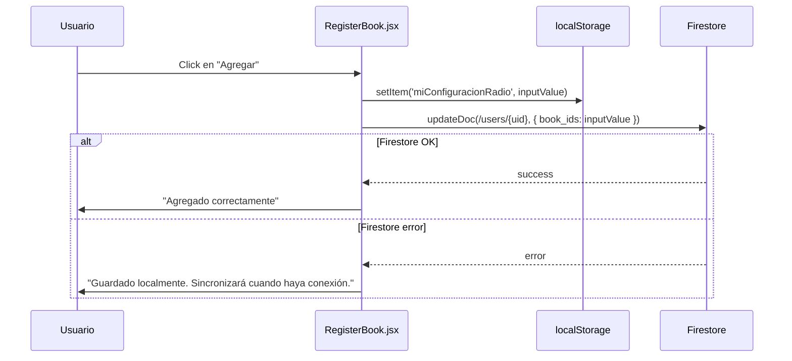
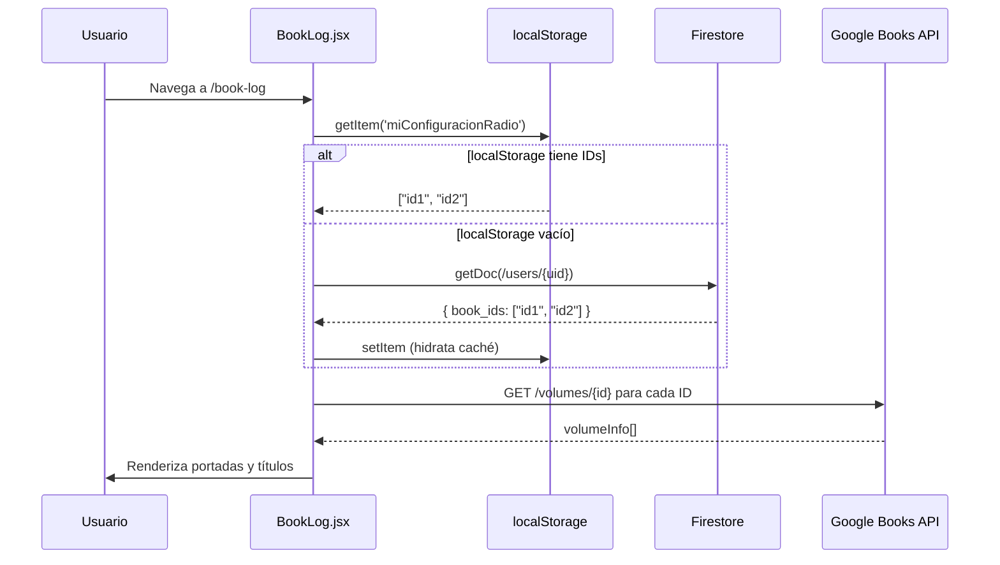

# Design Document: book-firestore-persistence

## Overview

Actualmente la biblioteca de libros del usuario (IDs de Google Books) se guarda exclusivamente en `localStorage` bajo la key `miConfiguracionRadio`. Esto significa que si el usuario cambia de dispositivo o limpia el navegador, pierde toda su biblioteca, lo que impacta directamente la retención (OMTM: 100 usuarios activos por 66 días).

Este feature migra la persistencia de la biblioteca de libros a **Firebase Firestore**, siguiendo el mismo patrón ya establecido para las rachas en `TimerProvider`. Los IDs de libros se almacenarán en el documento del usuario en `/users/{uid}` como un campo `book_ids: string[]`. Se mantiene `localStorage` como caché local para lecturas rápidas y funcionamiento offline, sincronizando con Firestore en los momentos clave: carga inicial y cada vez que el usuario guarda su selección.

---

## Architecture

```mermaid
graph TD
    A[Usuario] -->|Busca y selecciona libros| B[RegisterBook.jsx]
    A -->|Ve su biblioteca| C[BookLog.jsx]

    B -->|Lee IDs al montar| D[localStorage: miConfiguracionRadio]
    B -->|Lee IDs al montar| E[Firestore: /users/{uid}/book_ids]
    B -->|Guarda al hacer click en Agregar| D
    B -->|Guarda al hacer click en Agregar| E

    C -->|Lee IDs al montar| D
    C -->|Lee IDs al montar si localStorage vacío| E

    E -->|Fuente de verdad en la nube| F[(Firestore DB)]
    D -->|Caché local rápido| G[(localStorage)]

    H[AuthProvider.jsx] -->|Provee user.uid| B
    H -->|Provee user.uid| C
    I[firebase.js] -->|Exporta db| B
    I -->|Exporta db| C
```

---

## Sequence Diagrams

### Flujo: Usuario abre RegisterBook (primera vez o nuevo dispositivo)



### Flujo: Usuario guarda su selección de libros



### Flujo: Usuario abre BookLog



---

## Components and Interfaces

### Component 1: RegisterBook.jsx (modificado)

**Purpose**: Búsqueda y selección de libros. Persiste los IDs seleccionados tanto en `localStorage` como en Firestore.

**Interface** (cambios respecto al estado actual):
```javascript
// Nuevas dependencias a importar
import { useAuth } from '../Context/AuthProvider'
import { doc, getDoc, updateDoc } from 'firebase/firestore'
import { db } from '../../logic/firebase'

// Nuevo estado de sincronización
const [isSyncing, setIsSyncing] = useState(false)
const [syncError, setSyncError] = useState(null)
```

**Responsabilidades**:
- Al montar: leer IDs desde `localStorage`; si está vacío y hay usuario autenticado, leer desde Firestore e hidratar `localStorage`
- Al hacer click en "Agregar": guardar en `localStorage` (como ya hace) Y hacer `updateDoc` en Firestore con el array `book_ids`
- Mostrar feedback de error si Firestore falla (sin bloquear la UX)

### Component 2: BookLog.jsx (modificado)

**Purpose**: Muestra la biblioteca del usuario. Lee IDs desde `localStorage` con fallback a Firestore.

**Interface** (cambios respecto al estado actual):
```javascript
// Nuevas dependencias a importar
import { useAuth } from '../Context/AuthProvider'
import { doc, getDoc } from 'firebase/firestore'
import { db } from '../../logic/firebase'
```

**Responsabilidades**:
- Al montar: leer IDs desde `localStorage`; si está vacío y hay usuario autenticado, leer desde Firestore e hidratar `localStorage`
- Usar los IDs obtenidos para consultar Google Books API (lógica existente sin cambios)

---

## Data Models

### Extensión del documento de usuario en Firestore

El documento existente en `/users/{uid}` se extiende con un nuevo campo:

```javascript
// Documento actual
{
  email: string,          // "usuario@gmail.com"
  name: string,           // "Juan"
  created_at: Timestamp,  // fecha de primer registro
  last_session: Timestamp,// última sesión de lectura
  total_streak: number,   // racha actual
  max_streak: number      // racha máxima histórica
}

// Documento extendido (este feature agrega)
{
  // ...campos existentes sin cambios...
  book_ids: string[]      // ["volumeId1", "volumeId2", ...]
                          // IDs de Google Books API
                          // Default: [] (array vacío)
}
```

**Reglas de validación**:
- `book_ids` es un array de strings; nunca `null` (usar `[]` como valor por defecto)
- Cada string es un ID válido de Google Books API (formato: `[a-zA-Z0-9_-]+`)
- No hay límite de tamaño definido para el MVP, pero se recomienda < 100 libros por usuario

### localStorage (sin cambios estructurales)

```javascript
// Key existente — sin cambios
localStorage.key: 'miConfiguracionRadio'
localStorage.value: JSON.stringify(string[])  // array de IDs
```

---

## Key Functions with Formal Specifications

### Función 1: `loadBookIds(user, setInputValue)`

Carga los IDs de libros al montar el componente. Prioriza `localStorage`, con fallback a Firestore.

```javascript
async function loadBookIds(user, setInputValue)
```

**Preconditions:**
- `setInputValue` es una función de estado de React válida
- `user` puede ser `null` (usuario no autenticado) o un objeto Firebase User con `uid`

**Postconditions:**
- Si `localStorage` tiene IDs → `setInputValue` se llama con ese array; Firestore no se consulta
- Si `localStorage` está vacío Y `user !== null` → se consulta Firestore; si el doc tiene `book_ids`, se llama `setInputValue` con ese array Y se hidrata `localStorage`
- Si `localStorage` está vacío Y `user === null` → `setInputValue` se llama con `[]`
- En ningún caso se lanza una excepción no manejada; los errores de Firestore se capturan con `try/catch`

**Loop Invariants:** N/A (no contiene loops)

### Función 2: `saveBookIds(user, bookIds, setStatusMessage)`

Persiste el array de IDs al hacer click en "Agregar".

```javascript
async function saveBookIds(user, bookIds, setStatusMessage)
```

**Preconditions:**
- `bookIds` es un array de strings (puede ser vacío)
- `user` puede ser `null` o un Firebase User válido

**Postconditions:**
- `localStorage.setItem('miConfiguracionRadio', JSON.stringify(bookIds))` siempre se ejecuta
- Si `user !== null` → se ejecuta `updateDoc(/users/{uid}, { book_ids: bookIds })`
- Si `bookIds.length > 0` → `setStatusMessage('Agregado correctamente')`
- Si `bookIds.length === 0` → `setStatusMessage('Por favor, selecciona un libro')`
- Si Firestore falla → el error se loguea pero NO bloquea la UX; `localStorage` ya fue guardado

**Loop Invariants:** N/A

---

## Algorithmic Pseudocode

### Algoritmo: Carga inicial de IDs (al montar RegisterBook / BookLog)

```pascal
ALGORITHM loadBookIds(user, setInputValue)
INPUT: user (Firebase User | null), setInputValue (setState function)
OUTPUT: void (side effect: actualiza estado React y localStorage)

BEGIN
  // Paso 1: Intentar leer desde localStorage
  localIds ← localStorage.getItem('miConfiguracionRadio')
  
  IF localIds IS NOT NULL AND localIds IS NOT EMPTY THEN
    parsedIds ← JSON.parse(localIds)
    IF parsedIds IS VALID ARRAY AND parsedIds.length > 0 THEN
      setInputValue(parsedIds)
      RETURN  // localStorage tiene datos, no necesitamos Firestore
    END IF
  END IF
  
  // Paso 2: localStorage vacío — intentar Firestore si hay usuario
  IF user IS NULL THEN
    setInputValue([])
    RETURN
  END IF
  
  TRY
    userRef ← doc(db, 'users', user.uid)
    userSnap ← AWAIT getDoc(userRef)
    
    IF userSnap.exists() THEN
      data ← userSnap.data()
      firestoreIds ← data.book_ids OR []
      
      // Hidratar localStorage con datos de Firestore
      localStorage.setItem('miConfiguracionRadio', JSON.stringify(firestoreIds))
      setInputValue(firestoreIds)
    ELSE
      setInputValue([])
    END IF
    
  CATCH error
    console.error("Error al cargar book_ids desde Firestore:", error.message)
    setInputValue([])
  END TRY
END
```

**Preconditions:**
- `db` está inicializado y disponible
- `user.uid` es un string válido si `user !== null`

**Postconditions:**
- `setInputValue` siempre se llama exactamente una vez
- `localStorage` se hidrata si Firestore tenía datos y `localStorage` estaba vacío
- Nunca lanza excepción al componente padre

### Algoritmo: Guardar selección de libros (al hacer click en "Agregar")

```pascal
ALGORITHM saveBookIds(user, bookIds, setStatusMessage)
INPUT: user (Firebase User | null), bookIds (string[]), setStatusMessage (setState function)
OUTPUT: void (side effect: persiste en localStorage y Firestore)

BEGIN
  // Paso 1: Validar que hay libros seleccionados
  IF bookIds.length = 0 THEN
    setStatusMessage('Por favor, selecciona un libro')
    SCHEDULE clearMessage AFTER 3000ms
    RETURN
  END IF
  
  // Paso 2: Guardar siempre en localStorage (operación síncrona, nunca falla)
  localStorage.setItem('miConfiguracionRadio', JSON.stringify(bookIds))
  
  // Paso 3: Guardar en Firestore si hay usuario autenticado
  IF user IS NOT NULL THEN
    TRY
      userRef ← doc(db, 'users', user.uid)
      AWAIT updateDoc(userRef, { book_ids: bookIds })
    CATCH error
      console.error("Error al guardar book_ids en Firestore:", error.message)
      // No bloquear UX — localStorage ya fue guardado
    END TRY
  END IF
  
  // Paso 4: Confirmar al usuario
  setStatusMessage('Agregado correctamente')
  SCHEDULE clearMessage AFTER 3000ms
END
```

**Preconditions:**
- `bookIds` es un array (puede estar vacío)
- `localStorage` está disponible en el navegador

**Postconditions:**
- `localStorage` siempre refleja el estado más reciente de `bookIds`
- Si `user !== null`, Firestore refleja el mismo estado (salvo error de red)
- El usuario siempre recibe feedback visual

---

## Error Handling

### Escenario 1: Firestore no disponible al guardar

**Condición**: El usuario hace click en "Agregar" pero no hay conexión a internet o Firestore devuelve error.

**Respuesta**: El `catch` captura el error, lo loguea en consola. `localStorage` ya fue guardado antes del intento a Firestore, por lo que los datos no se pierden.

**Recovery**: La próxima vez que el usuario abra la app con conexión y guarde, Firestore se actualizará. No se implementa cola de sincronización offline en el MVP.

### Escenario 2: Firestore no disponible al cargar (nuevo dispositivo)

**Condición**: El usuario abre la app en un dispositivo nuevo, `localStorage` está vacío, y Firestore no responde.

**Respuesta**: El `catch` captura el error, `setInputValue([])` se llama con array vacío. La biblioteca aparece vacía.

**Recovery**: El usuario puede intentar recargar la página cuando haya conexión.

### Escenario 3: Usuario no autenticado

**Condición**: `user === null` (sesión expirada o usuario no logueado).

**Respuesta**: Se omite cualquier operación con Firestore. Solo se usa `localStorage`.

**Recovery**: El `ProtectedRoute` ya redirige a `/login` si no hay sesión, por lo que este escenario es teórico en producción.

### Escenario 4: `book_ids` no existe en el documento de Firestore (usuario antiguo)

**Condición**: El documento del usuario existe en Firestore (creado antes de este feature) pero no tiene el campo `book_ids`.

**Respuesta**: `data.book_ids` es `undefined`; el operador `OR []` lo convierte en array vacío. No hay error.

**Recovery**: La primera vez que el usuario guarde su selección, `updateDoc` creará el campo `book_ids` automáticamente.

---

## Testing Strategy

### Unit Testing Approach

Probar las funciones `loadBookIds` y `saveBookIds` de forma aislada, mockeando `localStorage`, Firestore (`getDoc`, `updateDoc`) y el objeto `user`.

Casos clave:
- `loadBookIds` con `localStorage` poblado → no llama a Firestore
- `loadBookIds` con `localStorage` vacío y usuario autenticado → llama a Firestore e hidrata `localStorage`
- `loadBookIds` con `localStorage` vacío y usuario `null` → retorna `[]`
- `loadBookIds` cuando Firestore lanza error → retorna `[]` sin propagar excepción
- `saveBookIds` con array vacío → no llama a Firestore, muestra mensaje de error
- `saveBookIds` con IDs y usuario autenticado → guarda en `localStorage` Y en Firestore
- `saveBookIds` cuando Firestore falla → `localStorage` igual se guarda, muestra "Agregado correctamente"

### Property-Based Testing Approach

**Property Test Library**: `fast-check` (ya disponible en el ecosistema Vite/React)

Propiedades a verificar:
- Para cualquier array de strings `bookIds`, `saveBookIds` siempre persiste en `localStorage` independientemente del resultado de Firestore
- Para cualquier `bookIds` no vacío, el mensaje de estado es siempre "Agregado correctamente" si `localStorage` tiene éxito
- `loadBookIds` siempre llama `setInputValue` exactamente una vez, sin importar el estado de `localStorage` o Firestore

### Integration Testing Approach

Probar el flujo completo en un entorno con Firebase Emulator:
1. Usuario nuevo → `loadBookIds` → array vacío
2. Usuario guarda IDs → `saveBookIds` → verificar en Firestore Emulator que `book_ids` se actualizó
3. Simular nuevo dispositivo (limpiar `localStorage`) → `loadBookIds` → IDs recuperados desde Firestore

---

## Performance Considerations

- **Lectura lazy**: Firestore solo se consulta si `localStorage` está vacío. En el caso normal (mismo dispositivo), no hay latencia adicional.
- **Una sola escritura**: `updateDoc` solo se llama al hacer click en "Agregar", no en cada cambio de checkbox. Esto minimiza las escrituras a Firestore (costo y cuota).
- **Sin listeners en tiempo real**: Se usa `getDoc` (lectura única) en lugar de `onSnapshot` (listener continuo), ya que la biblioteca no necesita sincronización en tiempo real entre pestañas.

---

## Security Considerations

Las reglas de seguridad de Firestore ya existentes cubren este feature:

```javascript
rules_version = '2';
service cloud.firestore {
  match /databases/{database}/documents {
    match /users/{uid} {
      allow read, write: if request.auth != null && request.auth.uid == uid;
    }
  }
}
```

- Cada usuario solo puede leer y escribir su propio `book_ids`
- No se exponen IDs de otros usuarios
- Los IDs de Google Books son públicos (no son datos sensibles)

---

## Dependencies

- `firebase/firestore`: `getDoc`, `updateDoc`, `doc` — ya instalado y configurado en `src/logic/firebase.js`
- `useAuth()` hook — ya disponible en `src/Components/Context/AuthProvider.jsx`
- `db` export — ya disponible en `src/logic/firebase.js`
- No se requieren nuevas dependencias npm
